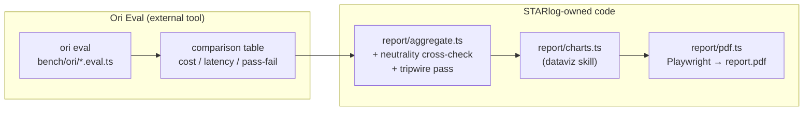

# STARlogBench — Alternative Plan: OpenRouter Ori Eval ("Plan B")

Same goal as [`starlogbench-plan.md`](./starlogbench-plan.md) ("Plan A"): find out which
model should generate STARlog's STAR stories, whether any of the current Chinese models
(DeepSeek, Kimi/Moonshot, Qwen, …), Mistral, or Gemma are worth integrating, and what
quality costs per 100 stories. Different engine: instead of hand-building a Mastra agent
panel, this plan adopts **Ori Eval**, a tool OpenRouter shipped specifically for "which
model fits my app" questions.

**Status:** plan only, not committed to. This is a companion document for comparison,
not a replacement — read the [head-to-head](#plan-a-vs-plan-b-head-to-head) section
before picking one.

## Table of Contents

- [Why consider this instead](#why-consider-this-instead)
- [What Ori Eval actually is (verified)](#what-ori-eval-actually-is-verified)
- [What Ori Eval does not give you](#what-ori-eval-does-not-give-you)
- [Decisions](#decisions)
- [Phase 0 — shared prerequisite](#phase-0--shared-prerequisite)
- [Phase O1 — install Ori and run the interview](#phase-o1--install-ori-and-run-the-interview)
- [Phase O2 — fixtures and judge criteria](#phase-o2--fixtures-and-judge-criteria)
- [Phase O3 — closing Ori's gaps](#phase-o3--closing-oris-gaps)
- [Phase O4 — CI, scheduling, auto-PR](#phase-o4--ci-scheduling-auto-pr)
- [Plan A vs Plan B head-to-head](#plan-a-vs-plan-b-head-to-head)
- [Recommendation and open questions](#recommendation-and-open-questions)
- [Verification](#verification)

## Why consider this instead

Plan A builds a bespoke agent framework: Mastra, a five-stage pipeline, a hand-written
multi-judge panel with blind scoring, position-swapped pairwise comparison, a dedicated
claim-level grounding agent, Krippendorff's α, tripwires — real code with real ongoing
maintenance. OpenRouter shipped a tool aimed at exactly the underlying question ("which
of these models actually fits what my code does") a few days after Plan A was written:

> Ori Eval: Find the Best Model for What You're Building — OpenRouter Blog, Jacky Liang,
> 2026-08-03. <https://openrouter.ai/blog/announcements/ori-eval/>

It scans a codebase for every model call site, interviews the developer about what
matters (cost, latency, tool-call accuracy, …), proposes candidates, writes runnable
`*.eval.ts` files, and — the part Plan A explicitly declined to build — can be scheduled
to re-run and open a PR automatically when a new model wins. If it covers most of what
Plan A's custom pipeline would do, adopting it trades a large one-off build for a
smaller integration on top of a tool OpenRouter maintains.

## What Ori Eval actually is (verified)

The primary announcement blog post returns `403 Forbidden` to automated fetches, so the
following is corroborated against OpenRouter's public skill definitions
(`OpenRouterTeam/skills` on GitHub) and search-indexed excerpts of the docs site, not the
blog post directly — cited per source, and flagged where something couldn't be confirmed
this way.

**Two separate pieces:** a general-purpose `ori` CLI (an agent harness for running coding
agents *through* OpenRouter — Claude Code, Codex, OpenCode, Hermes — with OAuth and model
selection), and **Ori Eval**, a skill built on top of it that specifically writes and runs
evals. Installing one gets you both.

**Install and auth** (`install-ori-harness` skill):

```sh
curl -fsSL https://openrouter.ai/labs/ori/install.sh | bash
ori --version
ori login          # OAuth; an existing OPENROUTER_API_KEY also works if exported
```

**Kick off Ori Eval** (`spawn-ori-eval` skill) — either paste the install/run instructions
into a coding agent, or run the OpenRouter MCP slash command:

```sh
curl -fsSL https://openrouter.ai/skills/spawn-ori-eval    # follow the printed instructions
# or, with the OpenRouter MCP server installed:
/spawn-ori-eval
```

**What happens next**, per the `spawn-ori-eval` skill definition: Ori is spawned as a
subprocess in a throwaway run directory (`/tmp/spawn-ori-eval-<hash>`, hash = first 12
hex chars of the SHA-256 of the repo path — deterministic per-repo, not committed
anywhere). It scans the codebase for model call sites, interviews the developer on
priorities, proposes ~5 candidate models, confirms them, and — critically — **never
writes the eval file itself**; a separate `create-eval` sub-skill does that, driven by a
pinned run/judge model:

| Constant | Value |
|---|---|
| `RUN_MODEL` | `openai/gpt-5.6-terra` |
| `JUDGE_MODEL` | `openai/gpt-5.6-terra` |

**The eval file format** (`*.eval.ts`, discovered by that exact suffix — files under
`pytest`/`vitest`/Go-test conventions are silently ignored) runs under **`bun test`**:

```ts
const run = await agent.run("dinner in Lisbon?");
run.tool("search").toBeCalled();
run.tool("delete_file").toNotBeCalled();
run.toComplete();
```

Assertions cover tool calls made/avoided, `toComplete()` (finished without erroring or
refusing), and open-ended answer quality via the pinned `JUDGE_MODEL`, graded against
criteria the developer states during the interview. The exact API surface for
judge-criteria assertions beyond the tool-call methods shown above isn't documented in
any source this research could reach — treat it as **unconfirmed** until hands-on with an
installed Ori.

**Running comparisons:** `ori eval` runs the checked-in `*.eval.ts` against the
configured candidates through a pinned harness and model per run, then reports a table —
catch-rate, p50 latency, $/request, pass/fail — with a reasoned recommendation. Every
comparison routes through OpenRouter, so "comprehensive model coverage" is a real claim,
not marketing: the same roster breadth Plan A's OpenRouter-only design already committed
to (see Plan A's Decisions table) is available here natively, with zero extra plumbing.

**Regression testing:** a bug described in prose (*"agent issues refunds without checking
the order"*) becomes a failing assertion directly; it stays in the suite after the fix as
a permanent regression test. Plan A has no equivalent — this is a genuine capability Plan
B gets for free.

**CI and scheduling:** `ori eval` is documented to behave like `bun test` for exit codes,
so it can gate a build. Because what Ori writes is ordinary code, it can be scheduled;
when a new model outperforms the pinned one, Ori opens a PR automatically. Plan A
deliberately built none of this (its CI is `workflow_dispatch`-only, per an explicit
earlier decision) — Ori Eval makes continuous re-evaluation close to free *if* STARlog
ever wants it, without having to build a scheduler.

**Where files land**, per OpenRouter's "Where Ori writes files" docs (search-indexed
excerpt, primary page also 403'd): a workspace-local `.ori/` holds event logs and session
transcripts (recommended for `.gitignore` — it can contain repo content and prompt text);
the home directory holds shared cache/config/telemetry; **eval files, exports, and
reports live in the system temp directory by default and are described as "throwaway
workspaces that can be deleted after the eval finishes."** That means a `*.eval.ts` Ori
writes during the interview is **not automatically a committed, re-runnable artifact** —
getting a durable, version-controlled eval requires deliberately copying the finalized
file out of the scratch run directory into the repo. This is a plan step (Phase O1
below), not something to assume happens on its own.

## What Ori Eval does not give you

Stated as plainly as Plan A stated its own trade-offs, because adopting a tool doesn't
exempt this plan from being honest about what it costs:

- **Judge neutrality.** `JUDGE_MODEL` is pinned to `openai/gpt-5.6-terra` — one model,
  one provider family, no documented blind scoring, no position-swap, no self-preference
  audit, no Krippendorff's α, no tripwires. If the "is it worth integrating" roster ever
  includes an OpenAI model, an OpenAI-family judge scoring an OpenAI-family candidate is
  exactly the self-preference risk Plan A's neutrality guarantees exist to catch — and
  Ori Eval doesn't document a mechanism to catch it. This is the single biggest rigor gap
  versus Plan A.
- **Hallucination depth.** Plan A's grounding check decomposes every action step into
  atomic claims and marks each supported/unsupported against the source transcript —
  a dedicated agent, a hard number. Ori Eval's answer-quality grading is a single judge
  scoring against developer-stated criteria; "each action step must be traceable to the
  transcript" can be *written* as a criterion, but it's one general-purpose judge call,
  not a dedicated decomposition step, and no evidence found that it's inherently more
  reliable at this specific task than an equivalent single-pass instruction would be in
  Plan A's own pipeline.
- **A PDF-with-charts deliverable.** Ori Eval's output is a comparison table (catch-rate,
  latency, cost, pass/fail) plus a reasoned recommendation, not a designed report. The
  original ask for this benchmark — *"visuell ansprechend und aussagekräftig (zB PDF mit
  charts)"* — isn't something Ori produces; it has to be built regardless of which plan
  is chosen (see Phase O3).
- **Deterministic roster control.** Plan A's model matrix is a checked-in list in
  `bench/src/config.ts` — exactly the models named, every time, with `core`/`extended`
  tiers. Ori Eval's candidate list comes out of an interview each time the developer
  reruns the interview flow; once confirmed it's presumably fixed inside the written eval
  file (not re-decided per `ori eval` run), but this plan can't confirm from public docs
  whether the eval file pins exact model IDs or a looser spec. Treat as **unconfirmed**.
- **Tool-call assertions have nothing to attach to today.** STARlog's three AI calls
  (`extractSTAR`, `extractCompetencies`, `generateInspirationQuestions`) are single-shot
  JSON-generation prompts — none of them call tools. `run.tool(...).toBeCalled()` /
  `.toNotBeCalled()`, a chunk of Ori Eval's own pitch, has no target in STARlog's current
  code. The only assertions that apply today are `run.toComplete()` and judge-graded
  quality — a narrower slice of Ori Eval's feature set than the tool markets.

None of this is a reason to reject Ori Eval — it's a reason to scope what it's used for
and what still needs building around it. See Phase O3.

## Decisions

| Decision | Choice | Rationale |
|---|---|---|
| Engine | **Ori Eval** for candidate generation, execution, and quality grading | Routes through OpenRouter natively (same roster-breadth commitment Plan A made), needs no custom agent framework, and gets regression-test-from-bug-report and scheduled auto-PR essentially for free. |
| Judge neutrality | **Layer a lightweight cross-check on top, don't trust the single pinned judge alone** | Given the self-preference gap above, run the same `*.eval.ts` a second time with an explicit non-OpenAI judge model if Ori Eval exposes a `JUDGE_MODEL` override (needs confirming — see Phase O3), and diff the two verdicts. Cheaper than Plan A's full panel, weaker than it too — a deliberate middle ground. |
| Report | **Thin custom `report/` stage on top of Ori's output**, reusing Plan A's Phase 5 design (HTML → Playwright `page.pdf()`, inline SVG charts) | Ori Eval doesn't produce a PDF; the polished-report requirement doesn't go away just because the engine changed. This is the one piece of Plan A's code this plan keeps outright. |
| Toolchain | **Bun, isolated to `bench/`** | `*.eval.ts` files require `bun test` to execute — a new runtime STARlog doesn't use anywhere else. Confined the same way Plan A confined Mastra: own subdirectory, own lockfile, doesn't touch root `npm ci` or `npm audit --audit-level=high`. |
| Eval file custody | **Copy Ori's generated `*.eval.ts` into the repo explicitly; don't rely on the scratch run directory** | Per "Where Ori writes files," eval files default to a throwaway temp workspace. A benchmark that can't be re-run from a committed artifact isn't a benchmark, it's a one-off chat session — so landing the file in `bench/ori/*.eval.ts` is a deliberate step, not an assumption. |

## Phase 0 — shared prerequisite

Identical to Plan A's [Phase 0](./starlogbench-plan.md#phase-0--close-the-prompt-drift):
extract `STAR_PROMPT` / `COMPETENCY_PROMPT` into `src/lib/prompts.ts`, fix the drift
already found in `tests/prompts/eval.ts`, add the drift-guard test. This is a prerequisite
regardless of which plan is chosen — the eval files in either plan need one prompt
source, not a copy that can drift. Not duplicated here; see Plan A for the full detail.

## Phase O1 — install Ori and run the interview

One-time, interactive, done by a developer locally — not automatable end-to-end, since
the interview is the point:

```sh
curl -fsSL https://openrouter.ai/labs/ori/install.sh | bash
ori login                                    # or export OPENROUTER_API_KEY
curl -fsSL https://openrouter.ai/skills/spawn-ori-eval   # follow the printed instructions
```

Point it at STARlog. It should find `extractSTAR` and `extractCompetencies` in
`src/lib/gemini.ts` (and, per the interview, presumably `generateInspirationQuestions` —
worth explicitly excluding it in the interview to match Plan A's v2 scoping, or including
it if the broader coverage is wanted here). Answer the interview with what Plan A already
worked out from `.claude/agents/ai-engineer.md` and `docs/ai-use-cases.md`: cost and
hallucination-avoidance matter most, latency is secondary, tool-call accuracy doesn't
apply (see the gap noted above).

When Ori proposes its ~5 candidates, steer it explicitly toward the roster Plan A's
Decisions table settled on — 3 Gemini variants, one current Chinese model, Mistral,
Gemma — rather than accepting whatever it defaults to; there's no evidence the interview
defaults align with a specific product's priorities without correction.

**Land the result in the repo.** Once Ori writes the `*.eval.ts` file (location TBD per
the scratch-directory finding above — likely surfaced at the end of the run), copy it
into `bench/ori/star-extraction.eval.ts` and `bench/ori/competency-extraction.eval.ts`
(or however Ori splits them) and commit it. Add `.ori/` to `.gitignore` alongside Plan
A's Phase 0 additions (`.env`, `bench/node_modules/`, `bench/runs/`) — the workspace-local
`.ori/` directory can contain prompt text and repo content per OpenRouter's own docs, and
has no reason to be committed.

## Phase O2 — fixtures and judge criteria

This content is harness-agnostic and carries over from Plan A's
[Phase 2](./starlogbench-plan.md#phase-2--stage-1-generate-candidates) fixture list
unchanged: the 5 existing cases in `tests/prompts/fixtures/star-inputs.json`, plus the
adversarial ones Plan A added (no measurable outcome, rambling transcript, mixed
German/English, prompt injection, junk job description). Feed these as the prompts in the
`agent.run(...)` calls inside the eval file.

**Judge criteria** — port Plan A's rubric dimensions (Phase 4, 3a) directly into the
prose criteria Ori Eval's interview asks for, since they derive from the same prompt
contract regardless of engine: Situation purity (`gemini.ts:57` forbids problem leaks
into Situation), Task sharpness, Result quality *where the input supports it*, action-step
groundedness (STARlog's own hallucination concern — write it as an explicit criterion:
*"every action step must be traceable to something stated in the transcript; flag
anything invented"*), and self-assessment calibration (does `quality.action: "low"`
actually correspond to thin actions).

## Phase O3 — closing Ori's gaps

Three things Ori Eval doesn't give STARlog, addressed with the smallest addition that
covers each:

**1. A neutrality cross-check.** If Ori Eval exposes a way to override `JUDGE_MODEL` per
run (unconfirmed — check `ori eval -h` once installed), run the same eval twice with two
judges from different provider families and diff the verdicts; a large disagreement means
the single-judge result from a normal run isn't trustworthy on its own. If no override
exists, this has to be a manual second pass — run the candidate outputs Ori already
produced through a small standalone judge call (reusing Plan A's rubric-judge design at a
much smaller scope: one judge, one pass, not the full panel) as an audit rather than
building it into the main loop.

**2. Tripwires.** Plan A's tripwire fixtures (`fixtures/tripwires.json` — a fabricated
action step, a Situation with a problem leak, wrong-language output, an out-of-vocabulary
competency tag) are cheap to port as-is: add them as additional `agent.run(...)` cases in
the eval file with an *expected-fail* assertion, and treat Ori's judge failing to catch
one the same way Plan A does — a signal the benchmark itself isn't trustworthy yet, not
just a candidate-model data point.

**3. The report.** This is where most of the remaining engineering effort actually goes.
`ori eval` output (JSON, per the comparison table it prints) becomes the input to a small
standalone `report/` package — not a whole `bench/` pipeline, just Plan A's Phase 5
verbatim: `aggregate.ts` reshapes Ori's per-candidate results (cost, latency, pass/fail,
plus whatever the neutrality cross-check and tripwire pass added) into `results.json`,
`report/charts.ts` (after loading the `dataviz` skill, same requirement as Plan A) draws
the same eight charts Plan A specified — radar, Bradley-Terry-style ranking bar,
quality-vs-cost Pareto scatter, hallucination bar, model×fixture heatmap, latency,
variance, benchmark-health — and `report/pdf.ts` renders HTML through Playwright
Chromium exactly as Plan A's Phase 5 describes.



Net effect: this plan keeps roughly one phase's worth of Plan A's code (the report
pipeline) and replaces four phases (generate, checks, judge panel, most of aggregate)
with an external tool plus an interview transcript.

## Phase O4 — CI, scheduling, auto-PR

Per Plan A's own explicit decision, CI stays `workflow_dispatch`-only — no cron, no PR
trigger, because the run costs money and produces a report for a human, not a gate. That
decision doesn't change here. What does change: Ori Eval's scheduled-run-plus-auto-PR
capability is available essentially for free the moment `bench/ori/*.eval.ts` exists in
the repo, if STARlog ever wants continuous "did a new model just get better than our
pinned one" monitoring later. Note it as an option, don't enable it — consistent with the
manual-trigger-only decision already made for Plan A, and worth exactly one line in
`bench/README.md` rather than a workflow file nobody asked for.

## Plan A vs Plan B head-to-head

| Axis | Plan A (bespoke Mastra) | Plan B (Ori Eval) |
|---|---|---|
| Build effort | High — five custom stages, a multi-agent judge panel, aggregation, report | Low-to-medium — an interview plus a report-only stage |
| Ongoing maintenance | STARlog owns all of it | OpenRouter owns the eval engine; STARlog owns fixtures, criteria, and the report |
| Model roster control | Deterministic, checked into `config.ts`, `core`/`extended` tiers | Interview-driven; steerable but not proven to be as precisely pinned |
| Judge neutrality | Built-in: blind, position-swapped, ≥3 judges from ≥2 families, self-preference audit, Krippendorff's α | Single pinned judge (`openai/gpt-5.6-terra`) by default; a cross-check can be layered on but isn't native |
| Hallucination detection | Dedicated claim-level grounding agent, reported as a hard rate | One judge criterion among several; no dedicated decomposition step |
| Tripwires / self-validation | Built-in requirement (≥90% catch rate gates trusting the run) | Portable as extra eval cases, not a native concept |
| Regression testing from a bug report | Not designed for this | Native: prose bug → failing assertion → permanent regression test |
| Scheduled re-eval + auto-PR | Not built (explicit decision) | Native, opt-in |
| PDF-with-charts report | Built | Not provided — built in this plan too, reusing Plan A's design |
| Cost visibility | OpenRouter per-generation metadata (after the OpenRouter-only revision) | Same — OpenRouter-native either way |
| New toolchain dependency | Mastra + the Vercel AI SDK (npm, pinned in `bench/package.json`) | An externally-installed `ori` binary (`curl \| bash`, not npm-pinnable) + Bun runtime for `*.eval.ts` |
| Tool-call assertions | N/A — not part of Plan A's design | Part of Ori Eval's pitch, but has no target in STARlog's current tool-free calls |
| Confidence in the design | High — every mechanism verified against STARlog's actual code | Medium — several mechanics (judge override, eval-file model pinning, exact judge-criteria DSL) are unconfirmed pending hands-on use |

## Recommendation and open questions

Ori Eval is worth adopting for the parts it's strong at — routing, cost/latency
measurement, and turning "we found a bug" into a permanent regression test — and worth
being cautious about for the parts this benchmark specifically cares about: neutral
judging and hallucination detection are the two things Plan A was built to get right, and
Ori Eval's defaults are weaker on both by design (one pinned judge, general-purpose
criteria). A defensible middle path: **use Ori Eval as the generation-and-execution
engine (replacing Plan A's Phases 2–3a), keep a small custom grounding/neutrality pass
for the specific claims that matter (replacing only Phases 3b–3d, not all of Phase 3),
and keep Plan A's report pipeline as-is (Phase 5).** That's a real reduction in bespoke
code without giving up the guarantees the "why" section of Plan A exists to provide.

Before committing either way, three things need hands-on confirmation that public docs
didn't settle: whether `JUDGE_MODEL` is overridable per run, the exact assertion API for
judge-graded criteria beyond `toBeCalled`/`toNotBeCalled`/`toComplete`, and whether a
confirmed candidate roster from the interview is pinned inside the written eval file or
re-resolved on each `ori eval` run. All three are answerable in the time it takes to run
Phase O1 once.

## Verification

Same bar as Plan A, adapted to this engine:

1. `ori eval` against the committed `bench/ori/*.eval.ts` produces a comparison table for
   every candidate in the agreed roster (3 Gemini variants, one Chinese model, Mistral,
   Gemma at minimum).
2. The tripwire cases ported into the eval file are caught at the same ≥90% bar Plan A
   requires — otherwise the same conclusion applies: don't trust the ranking yet.
3. The neutrality cross-check (Phase O3.1) is run at least once and its disagreement rate
   with the default judge is reported, not silently discarded.
4. `report/pdf.ts` produces a legible PDF from Ori's output with the same eight charts
   Plan A specifies.
5. `results.json` retains Ori's raw per-candidate output, so every number in the PDF
   traces back to a concrete `ori eval` result — same auditability bar as Plan A.

Sources consulted for this plan (the primary blog post 403'd to automated fetches;
everything below is corroborated independently):

- [Ori Eval: Find the Best Model for What You're Building](https://openrouter.ai/blog/announcements/ori-eval/) — OpenRouter Blog, Jacky Liang, 2026-08-03 (as supplied by the user; not independently fetchable)
- [`OpenRouterTeam/skills`](https://github.com/OpenRouterTeam/skills) — `spawn-ori-eval`, `install-ori-harness`, `openrouter-benchmarks` skill definitions
- [Where Ori writes files](https://openrouter.ai/docs/guides/ori/files) — OpenRouter docs (search-indexed excerpt; primary page 403'd)
